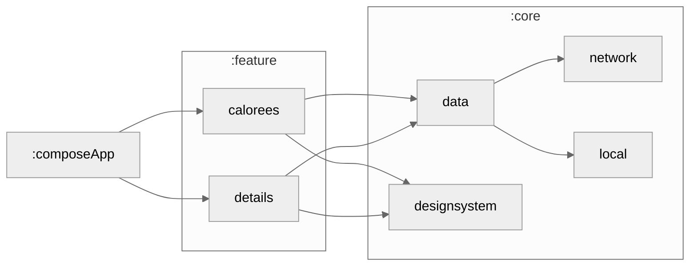

### Module Graph

```mermaid
%%{
  init: {
    'theme': 'neutral'
  }
}%%

graph LR
  subgraph :core
    :core:data["data"]
    :core:designsystem["designsystem"]
    :core:network["network"]
    :core:local["local"]
  end
  subgraph :feature
    :feature:calorees["calorees"]
    :feature:details["details"]
  end
  :feature:calorees --> :core:data
  :feature:calorees --> :core:designsystem
  :composeApp --> :feature:calorees
  :composeApp --> :feature:details
  :core:data --> :core:network
  :core:data --> :core:local
  :feature:details --> :core:data
  :feature:details --> :core:designsystem
```