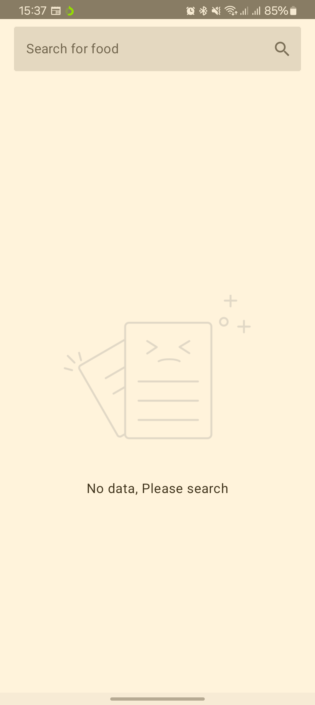

## Caloree
A simple app to fetch calorie details for food, built using Kotlin Multiplatform and a modularized architecture

## Prerequisites
To run the app from Android Studio on your local machine you'll need to add api_key value in your local.properties file

The API key can be generated from this [link](https://calorieninjas.com/api).
```
API_KEY = <YOUR_API_KEY>
```

## Architecture
The app has been built using a modularized layered architecture. The app has the following modules:
- **composeApp** - entry point to applications, contains navigation and overral di logic
- **details** - feature module to handle logic related to a single calorie food details i.e has a viewmodel and composambles
- **calorees** - feature module to handle logic related to searched list of calorie food i.e has a viewmodel and composambles
- **designsystem** - shared lib which contains shared components between the feature modules
- **data** - shared lib which contains the implementation of selecting data between `local` and `network` modules.
- **local** - shared lib which contains logic for saving data to local device storage
- **network** - shared lib which contains logic for fetching data from network
- **build-logic** - not an application module but rather a configuration module for setting reausable configs across the app

##### Modularization Graph

### Screenshots
|                                    Empty                                    |                                    List                                    |                                    Details                                    |
|:-----------------------------------------------------------------------------:|:---------------------------------------------------------------------------:|:--------------------------------------------------------------------------:|
|  |  |  |

#### Libraries and tech stack
- [Kotlin](https://kotlinlang.org/) - programming language
- [Kotlin Multiplatform](https://www.jetbrains.com/kotlin-multiplatform/) - Multiplaform framework
- [Compose Multiplatform](https://www.jetbrains.com/lp/compose-multiplatform/) - Declarative framework for sharing UIs across multiple platforms. Based on Kotlin and Jetpack Compose.
- [Koin](https://github.com/google/hilt](https://insert-koin.io/)) - a pragmatic lightweight dependency injection framework for Kotlin & Kotlin Multiplatform.
- [Ktor Client](https://ktor.io/) - networking client framework
- [KotlinX Serialization](https://github.com/Kotlin/kotlinx.serialization) - Serialization/Desirialization of JSON response from network.
- [KtLint](https://github.com/pinterest/ktlint) - An anti-bikeshedding Kotlin linter with built-in formatter
- [Room](https://developer.android.com/kotlin/multiplatform/room) - persistence library providing an abstraction layer over SQLite
  
#### CI/CD
- [Github Actions](https://github.com/kibettheophilus/caloree/tree/master/.github/workflows) - to run tests, run lint checks and assemble apk. The deployment workflows are WIP.

## Known Issues
- UI tests - I was not able to run tests for compose, the current impl is done following the androidTests structure. I however came across [writing and running compose multiplaform tests](https://www.jetbrains.com/help/kotlin-multiplatform-dev/compose-test.html#writing-and-running-tests-with-compose-multiplatform) and currently looking into it.

## Improvements
- UI/UX - improve the design of the app.
- Finish iOs implementation -  I mostly focused on android app and didn't test the iOs app.
